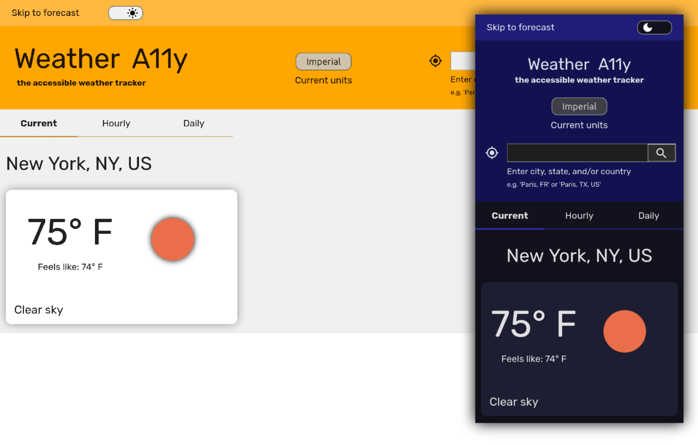
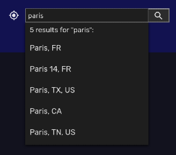

# Weather A11y

## Description

[Weather A11y](https://thatblindgeye.github.io/weather-a11y/) is a weather app built with accessibility in mind. meant to be your 'ally' that helps you plan ahead for any oncoming weather conditions.

## Features

- Accessibility-friendly; meant to be easily usable by screen readers, keyboard-only navigation, or other acessible technologies.
- Change between metric (Celsius and km/h) and imperial (Fahrenheit and mph) units.
- Check the current weather, a 24 hour forecast, or a 7 day forecast.
- The most recent location you searched for will be saved and loaded automatically the next time you use the app.

## How-To

### Use Your Location

When you click the geolocation button (to the left of the search field) and allow Weather A11y access, you'll get the forecast for whereever you may be.

**Note:** if you are using a VPN, this may interfere with the accuracy of the geolocation, and your location will not automatically update when you load the app again. You will need to click the geolocation button again in order to update the forecast for your new location.

### Search

You can search for a location by using any combination of city, state, and country. If your search returns more than one result, you'll be able to choose from the available results. If youre search returns no results, try adding to or changing your search. For example, instead of "Paris, TX", try searching just "Paris" or "Paris, TX, US".

### Change Units

Click the 'current units' button and you're all set! If you change the units before submitting a location, the weather data will be returned in the selected units. If you change the units for the currently dispalyed weather, a new API request will be made.
